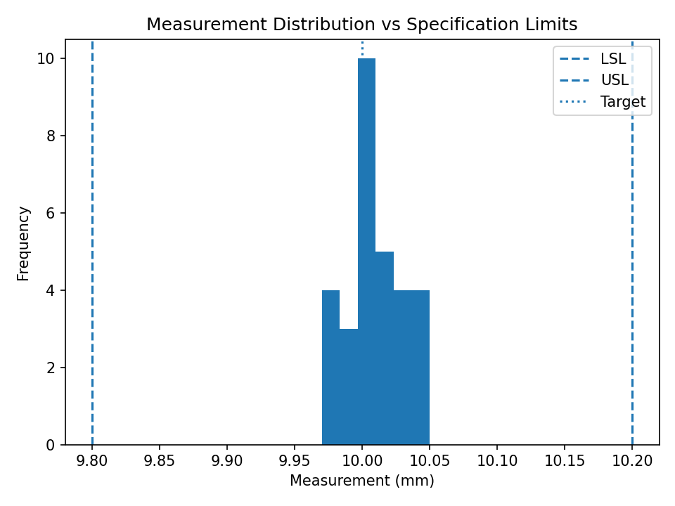
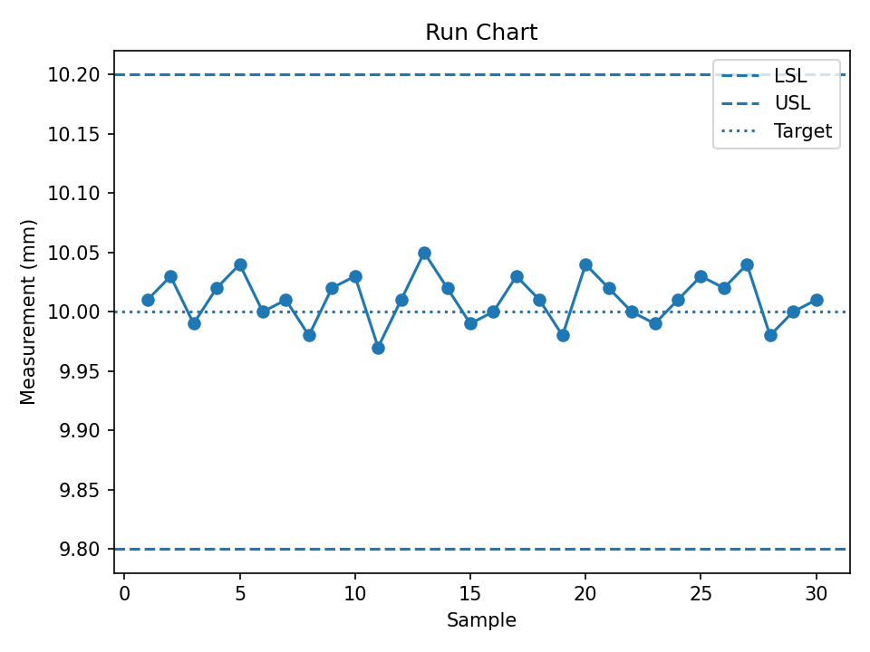
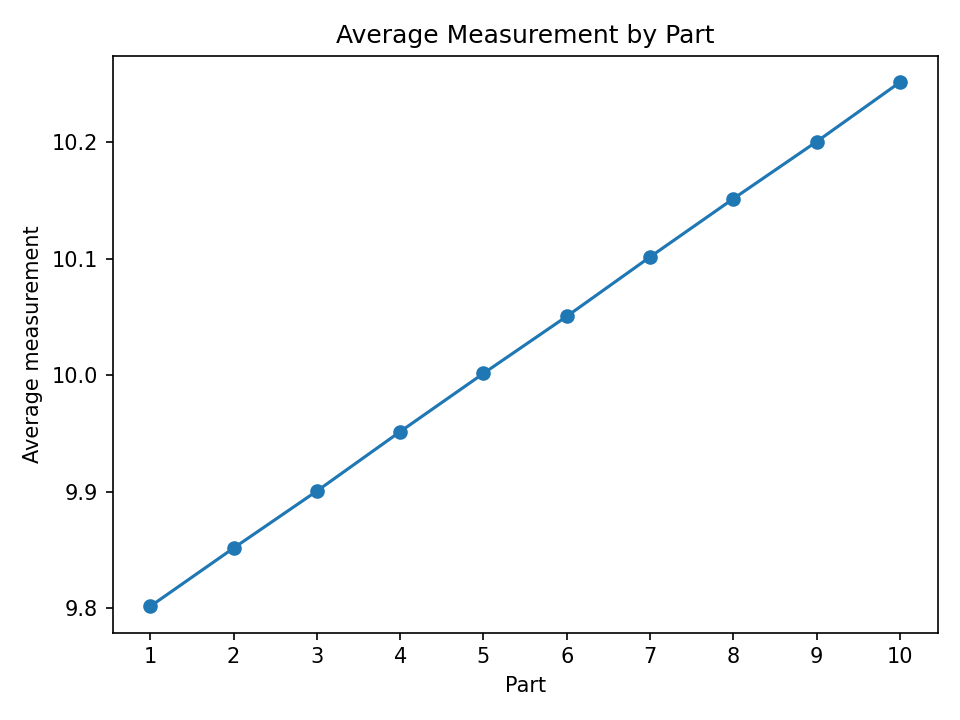
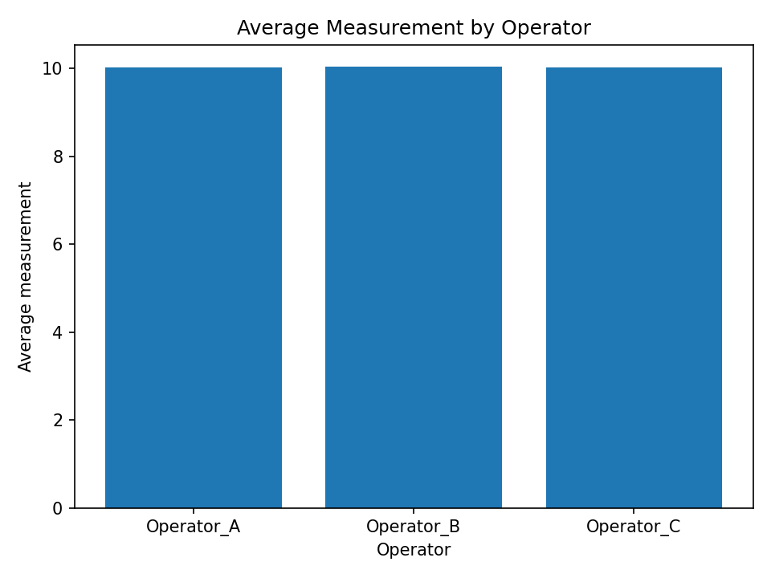
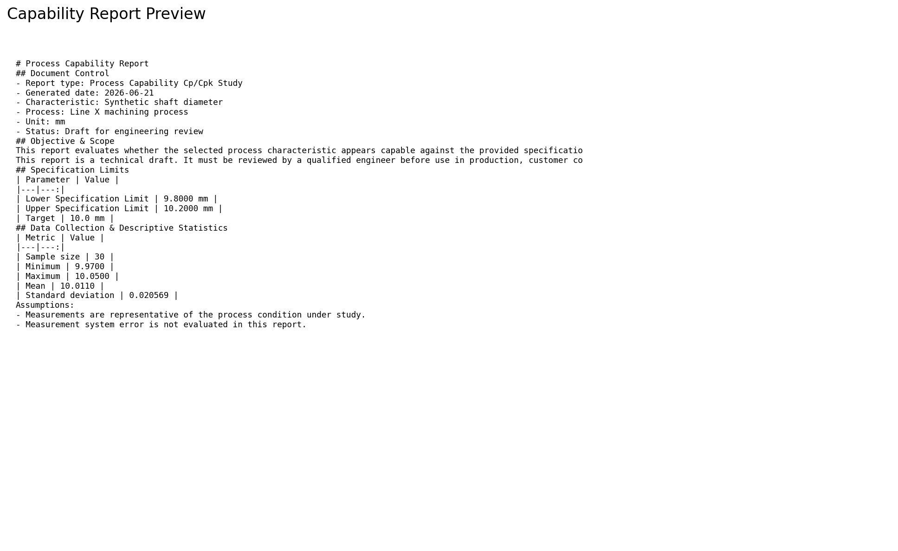
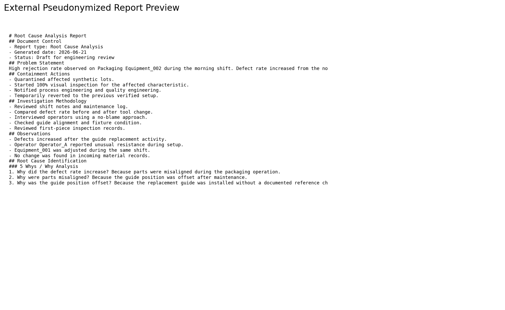

# Engineering Report Generator

## Category

Report Automation

## Status

Complete MVP

## Summary

Engineering Report Generator is a Python project that converts structured engineering data and notes into technical report drafts.

It supports four report workflows:

1. Process Capability Cp/Cpk Study
2. Measurement Systems Analysis / Gauge R&R Report
3. Root Cause Analysis Report
4. Standard Operating Procedure Technical Draft

The project also includes a privacy-aware AI review workflow using pseudonymized external reports and copy-paste review prompts.

## Engineering Problem

Process engineers often need to prepare reports from scattered inputs such as measurement data, specification limits, shift notes, investigation notes, and setup instructions.

This can be time-consuming and inconsistent. It can also create confidentiality risks if sensitive production or company information is shared with external AI tools.

## Solution

The tool uses a controlled workflow:

```text
Input manifest
  ↓
Input preparation report
  ↓
Privacy and sensitivity screening
  ↓
Engineering calculation or structured parsing
  ↓
Internal technical report
  ↓
AI review prompt
  ↓
External pseudonymized report
  ↓
Human engineering review
```

## Implemented Workflows

| Workflow | Output |
|---|---|
| Process Capability | Cp/Cpk report, normality screening, histogram, run chart |
| MSA / Gauge R&R | Balanced crossed Gauge R&R report and MSA charts |
| RCA | Structured Root Cause Analysis draft |
| SOP | Technical Standard Operating Procedure draft |

## Tools Used

* Python
* Pandas
* NumPy
* SciPy
* Matplotlib
* Typer
* Pytest
* Markdown
* GitHub Actions

## Screenshots

### Capability Histogram



### Capability Run Chart



### MSA Average by Part



### MSA Average by Operator



### Report Preview



### Pseudonymized Report Preview



## Responsible AI Design

Version 1 does not call AI APIs directly.

Instead, it generates:

* deterministic engineering reports,
* internal report versions,
* privacy risk reports,
* external pseudonymized report versions,
* AI review prompts,
* human review checklists.

The pseudonymization dictionary remains local and must not be committed to GitHub or shared externally.

## How to Run

From the project root:

```bash
python run_report.py --report-type all
```

Or run one workflow:

```bash
python run_report.py --report-type capability
python run_report.py --report-type msa
python run_report.py --report-type rca
python run_report.py --report-type sop
```

## Results

Milestone 1 completed:

```text
33 tests passed
```

All four report types were implemented as working MVP workflows.

## Limitations

* Uses synthetic data only.
* Not a validated quality management system.
* Not approved for production use without review.
* Privacy scanner is rule-based and does not guarantee full anonymization.
* AI review prompts require human engineering review.

## Next Steps

* Add Streamlit interface.
* Add richer export options.
* Improve visual summaries.
* Improve privacy detection.
* Add more realistic synthetic datasets.
